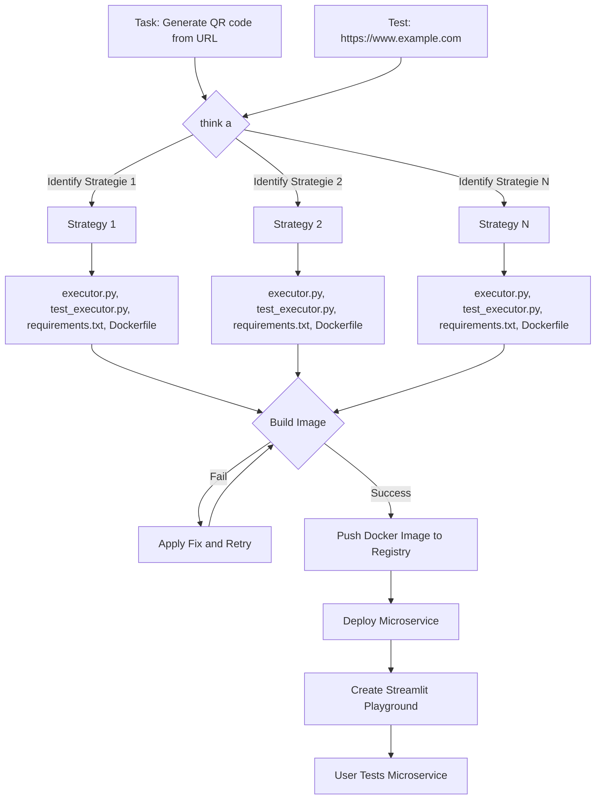

<h1 align="center">
GPT Deploy: One line to create them all 🧙🚀
</h1>


<p align="center">

</p>
<p align="center">
Turn your natural language descriptions into fully functional, deployed microservices with a single command!
Your imagination is the limit!
</p>

<p align="center">
<a href="https://github.com/tiangolo/fastapi/actions?query=workflow%3ATest+event%3Apush+branch%3Amaster" target="_blank">
    
</a>
<a href="https://coverage-badge.samuelcolvin.workers.dev/redirect/tiangolo/fastapi" target="_blank">
    
</a>
<a href="https://pypi.org/project/gptdeploy" target="_blank">
    
</a>
<a href="https://pypi.org/project/gptdeploy" target="_blank">
    
</a>
<a href="https://github.com/tiangolo/gptdeploy/actions?query=workflow%3ATest+event%3Apush+branch%3Amaster" target="_blank">
    
</a>

[//]: # ([![Watch the video]&#40;https://i.imgur.com/vKb2F1B.png&#41;]&#40;https://user-images.githubusercontent.com/11627845/226220484-17810f7c-b184-4a03-9af2-3a977fbb014b.mov&#41;)

</p>
This project streamlines the creation and deployment of microservices. 
Simply describe your task using natural language, and the system will automatically build and deploy your microservice. 
To ensure the microservice accurately aligns with your intended task a test scenario is required.

## Quickstart
### Installation
```bash
pip install gptdeploy
gptdeploy configure --key <your openai api key>
```
If you set the environment variable `OPENAI_API_KEY`, the configuration step can be skipped.

### run
```bash
gptdeploy create --description "Given a PDF, return it's text" --test "https://www.africau.edu/images/default/sample.pdf"
```
To create your personal microservice two things are required:
- A `description` of the task you want to accomplish.
- A `test` scenario that ensures the microservice works as expected.

The creation process should take between 5 and 15 minutes.
During this time, GPT iteratively builds your microservice until it finds a strategy that make you test scenario pass.
Once the microservice is created and deployed, you can test it using the generated Streamlit playground.

## Overview
The graphic below illustrates the process of creating a microservice and deploying it to the cloud.

1. GPT Deploy identifies several strategies to implement your task.
2. It tests each strategy until it finds one that works.
3. For each strategy, it creates the following files:
- executor.py: This is the main implementation of the microservice.
- test_executor.py: These are test cases to ensure the microservice works as expected.
- requirements.txt: This file lists the packages needed by the microservice and its tests.
- Dockerfile: This file is used to run the microservice in a container and also runs the tests when building the image.
4. GPT Deploy attempts to build the image. If the build fails, it uses the error message to apply a fix and tries again to build the image.
5. Once it finds a successful strategy, it:
- Pushes the Docker image to the registry.
- Deploys the microservice.
- Creates a Streamlit playground where you can test the microservice.
6. If it fails 10 times in a row, it moves on to the next approach.

## Examples

### Meme Generator
```bash
gptdeploy create --description "Generate a meme from an image and a caption" --test "Surprised Pikachu: https://media.wired.com/photos/5f87340d114b38fa1f8339f9/master/w_1600%2Cc_limit/Ideas_Surprised_Pikachu_HD.jpg, TOP:When you discovered GPTDeploy"
```


### Rhyme Generator
```bash
gptdeploy create --description "Given a word, return a list of rhyming words using the datamuse api" --test "hello"
```


### 3d model info
```bash
gptdeploy create --description "Given a 3d object, return vertex count and face count" --test "https://raw.githubusercontent.com/polygonjs/polygonjs-assets/master/models/wolf.obj"
```


### Table extraction
```bash
--description "Given a URL, extract all tables as csv" --test "http://www.ins.tn/statistiques/90"
```


### Audio to mel spectrogram
```bash
gptdeploy create --description "Create mel spectrograms from audio file" --test "https://cdn.pixabay.com/download/audio/2023/02/28/audio_550d815fa5.mp3"
```


### Text to speech
```bash
gptdeploy create --description "Convert text to speech" --test "Hello, welcome to GPT Deploy!"
```
<a href=res/text_to_speech_example.wav></a>

<audio controls>
  <source src="res/text_to_speech_example.wav" type="audio/mpeg">
  Your browser does not support the audio element.
</audio>

### Heatmap Generator
```bash
gptdeploy create --description "Create a heatmap from an image and a list of relative coordinates" --test "https://images.unsplash.com/photo-1574786198875-49f5d09fe2d2, [[0.1, 0.2], [0.3, 0.4], [0.5, 0.6], [0.2, 0.1], [0.7, 0.2], [0.4, 0.2]]"
```


### QR Code Generator
```bash
gptdeploy create --description "Generate QR code from URL" --test "https://www.example.com"
```


[//]: # (## TO BE TESTED)

[//]: # (### ASCII Art Generator)

[//]: # (```bash)

[//]: # (gptdeploy create --description "Convert image to ASCII art" --test "https://images.unsplash.com/photo-1602738328654-51ab2ae6c4ff")

[//]: # (```)

[//]: # (### Password Strength Checker)

[//]: # (```bash)

[//]: # (gptdeploy create --description "Given a password, return a score from 1 to 10 indicating the strength of the password" --test "Pa$$w0rd")

[//]: # (```)

[//]: # (### Morse Code Translator)

[//]: # (```bash)

[//]: # (gptdeploy create --description "Convert text to morse code" --test "Hello, welcome to GPT Deploy!")

[//]: # (```)

[//]: # (### IP Geolocation)

[//]: # (```bash)

[//]: # (gptdeploy create --description "Given an IP address, return the geolocation information" --test "142.251.46.174")

[//]: # (```)

[//]: # (### Currency Converter)

[//]: # (```bash)

[//]: # (gptdeploy create --description "Converts any currency into any other" --test "1 usd to eur")

[//]: # (```)

[//]: # (### Image Resizer)

[//]: # (```bash)

[//]: # (gptdeploy create --description "Given an image, resize it to a specified width and height" --test "https://images.unsplash.com/photo-1602738328654-51ab2ae6c4ff")

[//]: # (```)

[//]: # (### Weather API)

[//]: # (```bash)

[//]: # (gptdeploy create --description "Given a city, return the current weather" --test "Berlin")

[//]: # (```)

[//]: # ()
[//]: # (### Sudoku Solver)

[//]: # (```bash)

[//]: # (gptdeploy create --description "Given a sudoku puzzle, return the solution" --test "[[2, 5, 0, 0, 3, 0, 9, 0, 1], [0, 1, 0, 0, 0, 4, 0, 0, 0], [4, 0, 7, 0, 0, 0, 2, 0, 8], [0, 0, 5, 2, 0, 0, 0, 0, 0], [0, 0, 0, 0, 9, 8, 1, 0, 0], [0, 4, 0, 0, 0, 3, 0, 0, 0], [0, 0, 0, 3, 6, 0, 0, 7, 2], [0, 7, 0, 0, 0, 0, 0, 0, 3], [9, 0, 3, 0, 0, 0, 6, 0, 4]]")

[//]: # (```)

[//]: # ()
[//]: # (### Carbon Footprint Calculator)

[//]: # (```bash)

[//]: # (gptdeploy create --description "Estimate a company's carbon footprint based on factors like transportation, electricity usage, waste production etc..." --test "Jina AI")

[//]: # (```)

[//]: # ()
[//]: # (### Real Estate Valuation Estimator)

[//]: # (```bash)

[//]: # (gptdeploy create --description "Create a microservice that estimates the value of a property based on factors like location, property type, age, and square footage." --test "Berlin Friedrichshain, Flat, 100m², 10 years old")

[//]: # (```)

[//]: # ()
[//]: # (### Gene Sequence Alignment)

[//]: # (```bash)

[//]: # (gptdeploy create --description "Align two DNA or RNA sequences using the Needleman-Wunsch algorithm" --test "AGTC, GTCA")

[//]: # (```)

[//]: # ()
[//]: # (### Markdown to HTML Converter)

[//]: # (```bash)

[//]: # (gptdeploy create --description "Convert markdown to HTML" --test "# Hello, welcome to GPT Deploy!")

[//]: # (```)

[//]: # ()
[//]: # (### Barcode Generator)

[//]: # (```bash)

[//]: # (gptdeploy create --description "Generate a barcode from a string" --test "Hello, welcome to GPT Deploy!")

[//]: # (```)

[//]: # ()
[//]: # (### File Compression)

[//]: # (```bash)

[//]: # (gptdeploy create --description "Compress a file using the gzip algorithm" --test "content of the file: Hello, welcome to GPT Deploy!")

[//]: # (```)

[//]: # ()
[//]: # (### Watermarking Images)

[//]: # (```bash)

[//]: # (gptdeploy create --description "Add a watermark &#40;GPT Deploy&#41; to an image" --test "https://images.unsplash.com/photo-1602738328654-51ab2ae6c4ff")

[//]: # (```)

[//]: # ()
[//]: # (### File Metadata Extractor)

[//]: # (```bash)

[//]: # (gptdeploy create --description "Extract metadata from a file" --test "https://images.unsplash.com/photo-1602738328654-51ab2ae6c4ff")

[//]: # (```)

[//]: # ()
[//]: # (### Video Thumbnail Extractor)

[//]: # (```bash)

[//]: # (gptdeploy create --description "Extract a thumbnail from a video" --test "http://techslides.com/demos/sample-videos/small.mp4")

[//]: # (```)

[//]: # ()
[//]: # (### Gif Maker)

[//]: # (```bash)

[//]: # (gptdeploy create --description "Create a gif from a list of images" --test "https://images.unsplash.com/photo-1564725075388-cc8338732289, https://images.unsplash.com/photo-1584555684040-bad07f46a21f, https://images.unsplash.com/photo-1584555613497-9ecf9dd06f68")

[//]: # (```)

[//]: # ()
[//]: # (### Word Cloud Generator)

[//]: # (```bash)

[//]: # (gptdeploy create --description "Generate a word cloud from a given text" --test "Lorem ipsum dolor sit amet, consectetur adipiscing elit.")

[//]: # (```)

[//]: # ()
[//]: # (### Mandelbrot Set Visualizer)

[//]: # (```bash)

[//]: # (gptdeploy create --description "Visualize the Mandelbrot set with custom parameters" --test "center=-0.5+0i, zoom=1.0, size=800x800, iterations=1000")

[//]: # (```)


[//]: # (## Upcoming Challenges)

[//]: # (### Chemical Structure Drawing)

[//]: # (```bash)

[//]: # (gptdeploy create --description "Convert a chemical formula into a 2D chemical structure diagram" --test "C6H6")

[//]: # (```)

[//]: # (### Color Palette Generator)

[//]: # (```bash)

[//]: # (gptdeploy create --description "creates aesthetically pleasing color palettes based on a seed color, using color theory principles like complementary or analogous colors" --test "red")

[//]: # (```)

[//]: # ()
[//]: # (### Depth Map Generator)

[//]: # (```bash)

[//]: # (gptdeploy create --description "Generate a depth map from a 3d Object" --test "https://raw.githubusercontent.com/polygonjs/polygonjs-assets/master/models/wolf.obj")

[//]: # (```)

[//]: # ()
[//]: # (### Bounding Box)

[//]: # (```bash)

[//]: # (gptdeploy create --description "Given an image, return the bounding boxes of all animals" --test "...")

[//]: # (```)

## 🔮 vision
Use natural language interface to create, deploy and update your microservice infrastructure.

## ✨ Contributers 
If you want to contribute to this project, feel free to open a PR or an issue.
In the following, you can find a list of things that need to be done.

Critical:
- [ ] fix problem with package installation
- [ ] add instruction about cleanup of deployments

Nice to have:
- [ ] hide prompts in normal mode and show them in verbose mode
- [ ] tests
- [ ] clean up duplicate code
- [ ] support popular cloud providers - lambda, cloud run, cloud functions, ...
- [ ] support local docker builds
- [ ] autoscaling enabled for cost saving
- [ ] don't show this message: 
🔐 You are logged in to Jina AI as florian.hoenicke (username:auth0-unified-448f11965ce142b6). 
To log out, use jina auth logout.
- [ ] add more examples to README.md
- [ ] support multiple endpoints - example: todolist microservice with endpoints for adding, deleting, and listing todos
- [ ] support stateful microservices
- [ ] The playground is currently printed twice even if it did not change. 
Make sure it is only printed twice in case it changed.
- [ ] allow to update your microservice by providing feedback
- [ ] bug: it can happen that the code generation is hanging forever - in this case aboard and redo the generation
- [ ] feat: make playground more stylish by adding attributes like: clean design, beautiful, like it was made by a professional designer, ...
- [ ] support for other large language models like ChatGLM
- [ ] for cost savings, it should be possible to insert less context during the code generation of the main functionality - no jina knowledge is required
