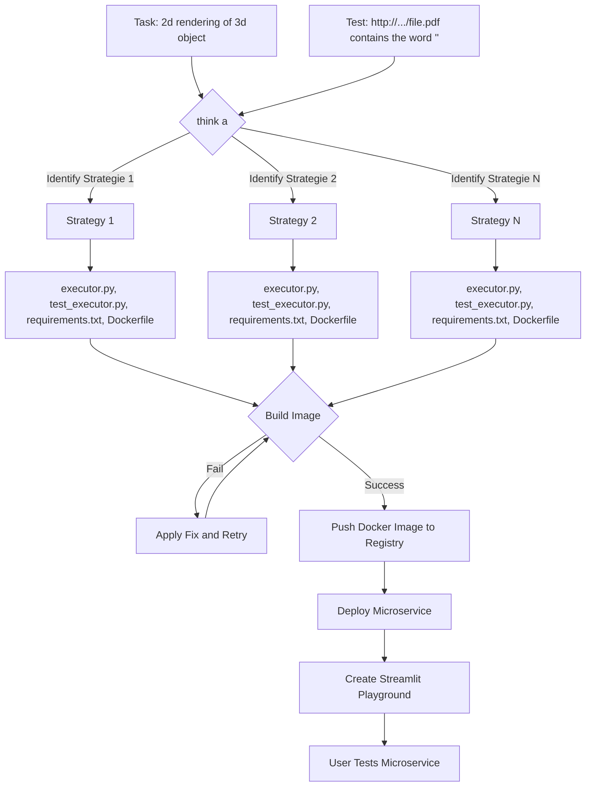

# 🤖 GPT Deploy
This project streamlines the creation and deployment of microservices. 
Simply describe your task using natural language, and the system will automatically build and deploy your microservice. 
To ensure the executor accurately aligns with your intended task, you can also provide test scenarios.

# Quickstart
## install
```bash
pip install gptdeploy
```

## run
```bash
gptdeploy --description "Take a pdf file as input, and returns the text it contains." \
--test "Takes https://www2.deloitte.com/content/dam/Deloitte/de/Documents/about-deloitte/Deloitte-Unternehmensgeschichte.pdf and returns a string that is at least 100 characters long"
```


# Overview
The graphic below illustrates the process of creating a microservice and deploying it to the cloud.

1. GPT Deploy identifies several strategies to implement your task.
2. It tests each strategy until it finds one that works.
3. For each strategy, it creates the following files:
- executor.py: This is the main implementation of the microservice.
- test_executor.py: These are test cases to ensure the microservice works as expected.
- requirements.txt: This file lists the packages needed by the microservice and its tests.
- Dockerfile: This file is used to run the microservice in a container and also runs the tests when building the image.
4. GPT Deploy attempts to build the image. If the build fails, it uses the error message to apply a fix and tries again to build the image.
5. Once it finds a successful strategy, it:
- Pushes the Docker image to the registry.
- Deploys the microservice.
- Creates a Streamlit playground where you can test the microservice.
6. If it fails 10 times in a row, it moves on to the next approach.

# Examples
```bash
gptdeploy --description "Generate a QR code from a given text or URL" --test "https://www.example.com"
```

```bash
gptdeploy --description "Extract information about a 3D model, such as vertex count and face count" --test "https://www.example.com/model.obj"
```

# 🤏 limitations for now
- stateless microservices only
- deterministic microservices only to make sure input and output pairs can be used

# 🔮 vision
Use natural language interface to create, deploy and update your microservice infrastructure.

# TODO
critical
- [x] auto login for jina

Nice to have
- [ ] verbose mode
- [ ] tests
- [ ] clean up duplicate code

[//]: # ([![Watch the video]&#40;https://i.imgur.com/vKb2F1B.png&#41;]&#40;https://user-images.githubusercontent.com/11627845/226220484-17810f7c-b184-4a03-9af2-3a977fbb014b.mov&#41;)
