<h1 align="center">
GPT Deploy: One line to generate them all 🧙🚀
</h1>

<p align="center">

</p>
<p align="center">
Turn your natural language descriptions into fully functional, deployed AI-powered microservices with a single command!
Your imagination is the limit!
</p>

<p align="center">
<a href="https://github.com/tiangolo/fastapi/actions?query=workflow%3ATest+event%3Apush+branch%3Amaster" target="_blank">
    
</a>
<a href="https://coverage-badge.samuelcolvin.workers.dev/redirect/tiangolo/fastapi" target="_blank">
    
</a>
<a href="https://pypi.org/project/gptdeploy" target="_blank">
    
</a>
<a href="https://pypi.org/project/gptdeploy" target="_blank">
    
</a>
<a href="https://github.com/tiangolo/gptdeploy/actions?query=workflow%3ATest+event%3Apush+branch%3Amaster" target="_blank">
    
</a>
<a href="https://pypistats.org/packages/gptdeploy" target="_blank">
    
</a>
<a href="https://discord.gg/ESn8ED6Fyn" target="_blank">
    
</a>


[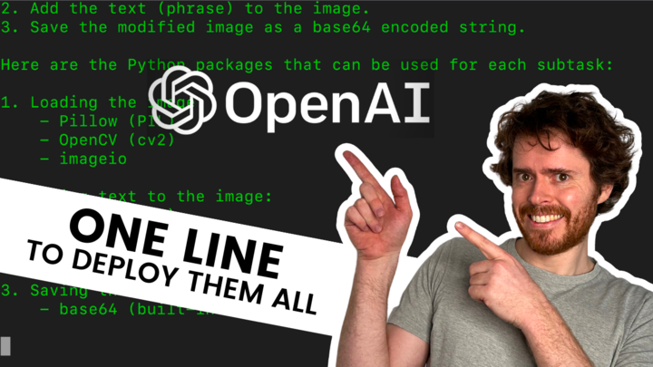](https://user-images.githubusercontent.com/11627845/231530421-272a66aa-4260-4e17-ab7a-ba66adca754c.mp4)

</p>
This project streamlines the creation and deployment of AI-powered microservices. 
Simply describe your task using natural language, and the system will automatically build and deploy your microservice. 
To ensure the microservice accurately aligns with your intended task a test scenario is required.

## Quickstart
### Requirements
- OpenAI key with access to GPT-3.5 or GPT-4 

### Installation
```bash
pip install gptdeploy
gptdeploy configure --key <your openai api key>
```
If you set the environment variable `OPENAI_API_KEY`, the configuration step can be skipped.
Your api key must have access to gpt-4 to use this tool. 
We are working on a way to use gpt-3.5-turbo as well.

### Generate Microservice
```bash
gptdeploy generate \
--description "<description of the microservice>" \
--model <gpt-3.5 or gpt-4> \
--path </path/to/local/folder>
```
To generate your personal microservice two things are required:
- A `description` of the task you want to accomplish. (optional)
- The `model` you want to use - either `gpt-3.5` or `gpt-4`. `gpt-3.5` is ~10x cheaper, 
but will not be able to generate as complex microservices. (default: largest you have access to)
- A `path` on the local drive where the microservice will be generated. (default: ./microservice)

The creation process should take between 5 and 15 minutes.
During this time, GPT iteratively builds your microservice until it finds a strategy that make your test scenario pass.

Be aware that the costs you have to pay for openai vary between $0.50 and $3.00 per microservice (using GPT-4).

### Run Microservice
Run the microservice locally in docker. In case docker is not running on your machine, it will try to run it without docker.
With this command a playground opens in your browser where you can test the microservice.
```bash
gptdeploy run --path <path to microservice>
```


### Deploy Microservice
If you want to deploy your microservice to the cloud a [Jina account](https://cloud.jina.ai/) is required.
When creating a Jina account, you get some free credits, which you can use to deploy your microservice ($0.025/hour).
If you run out of credits, you can purchase more.
```bash
gptdeploy deploy --microservice_path <path to microservice>
```


### Delete Microservice
To save credits you can delete your microservice via the following commands:
```bash
jc list # get the microservice id
jc delete <microservice id>
```

## Examples
In this section you can get a feeling for the kind of microservices that can be generated with GPT Deploy.

### Compliment Generator
```bash
gptdeploy generate \
--description "The user writes something and gets a related deep compliment." \
--model gpt-4
```
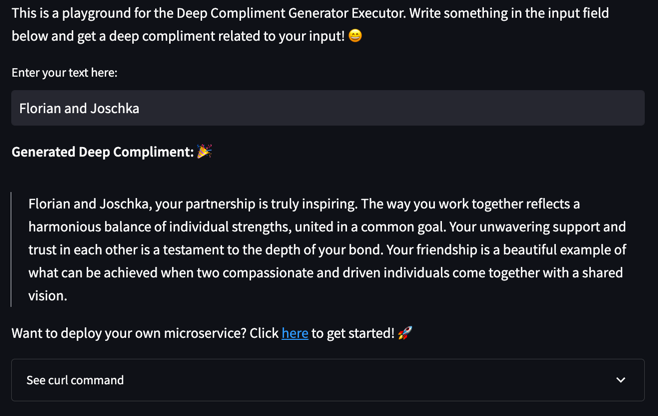


### Extract and summarize news articles given a URL
```bash
gptdeploy generate \
--description "Extract text from a news article URL using Newspaper3k library and generate a summary using gpt. Example input: http://fox13now.com/2013/12/30/new-year-new-laws-obamacare-pot-guns-and-drones/" \
--model gpt-4
```
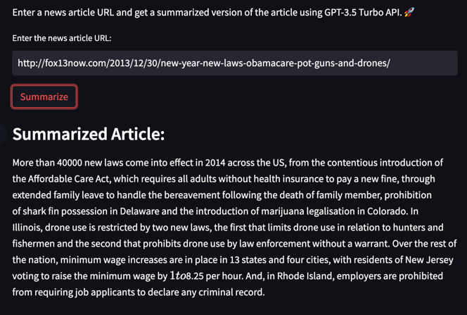

### Chemical Formula Visualization
```bash
gptdeploy generate \
--description "Convert a chemical formula into a 2D chemical structure diagram. Example inputs: C=C, CN=C=O, CCC(=O)O" \
--model gpt-4
```
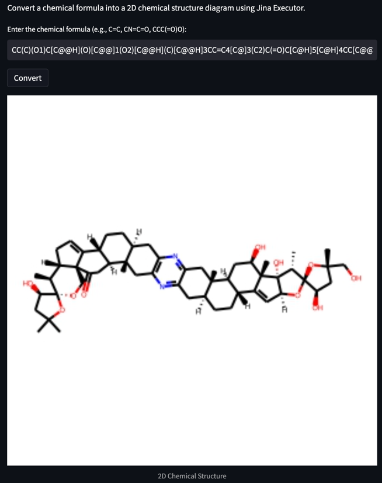

### 2d rendering of 3d model
```bash
gptdeploy generate \
--description "create a 2d rendering of a whole 3d object and x,y,z object rotation using trimesh and pyrender.OffscreenRenderer with os.environ['PYOPENGL_PLATFORM'] = 'egl' and freeglut3-dev library - example input: https://graphics.stanford.edu/courses/cs148-10-summer/as3/code/as3/teapot.obj" \
--model gpt-4
```


### Product Recommendation
```bash
gptdeploy generate \
--description "Generate personalized product recommendations based on user product browsing history and the product categories fashion, electronics and sport. Example: Input: browsing history: prod1(electronics),prod2(fashion),prod3(fashion), output: p4(fashion)" \
--model gpt-4
```


### Hacker News Search
```bash
gptdeploy generate \
--description "Given a search query, find articles on hacker news using the hacker news api and return a list of (title, author, website_link, first_image_on_the_website)" \
--model gpt-4
````
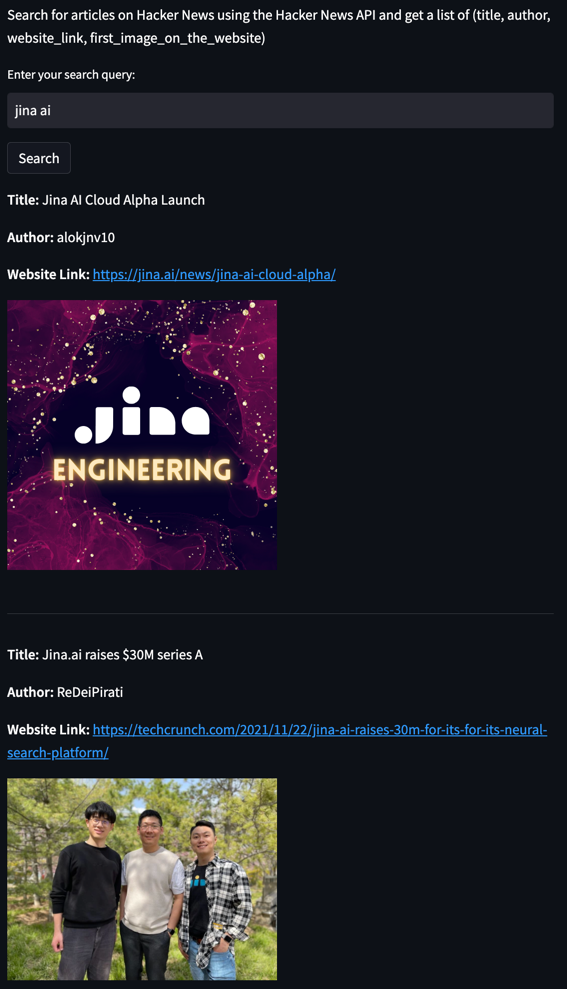

### Animal Detector
```bash

gptdeploy generate \
--description "Given an image, return the image with bounding boxes of all animals (https://pjreddie.com/media/files/yolov3.weights, https://raw.githubusercontent.com/pjreddie/darknet/master/cfg/yolov3.cfg), Example input: https://images.unsplash.com/photo-1444212477490-ca407925329e" \
--model gpt-4
```
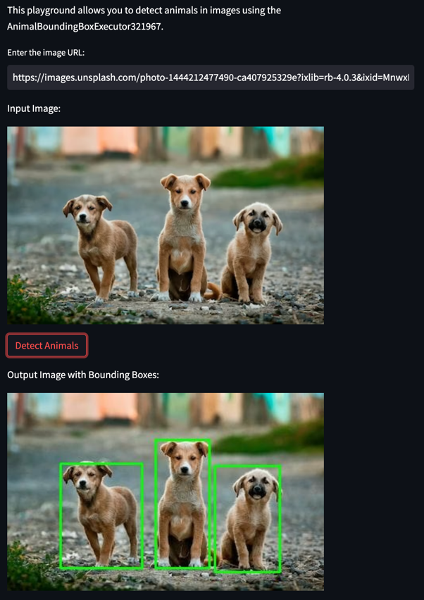

### Meme Generator
```bash
gptdeploy generate \
--description "Generate a meme from an image and a caption. Example input: https://media.wired.com/photos/5f87340d114b38fa1f8339f9/master/w_1600%2Cc_limit/Ideas_Surprised_Pikachu_HD.jpg, TOP:When you discovered GPTDeploy" \
--model gpt-4
```
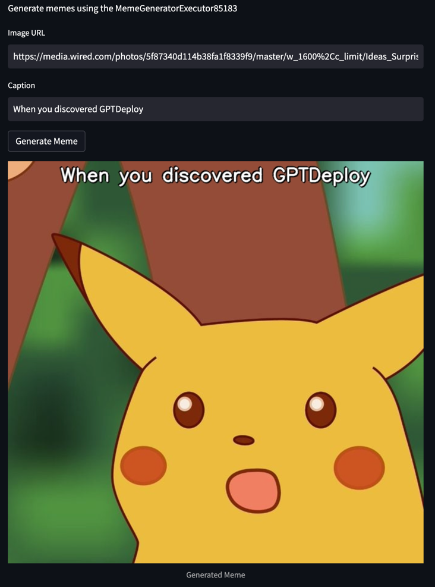

### Rhyme Generator
```bash
gptdeploy generate \
--description "Given a word, return a list of rhyming words using the datamuse api" \
--model gpt-4
```
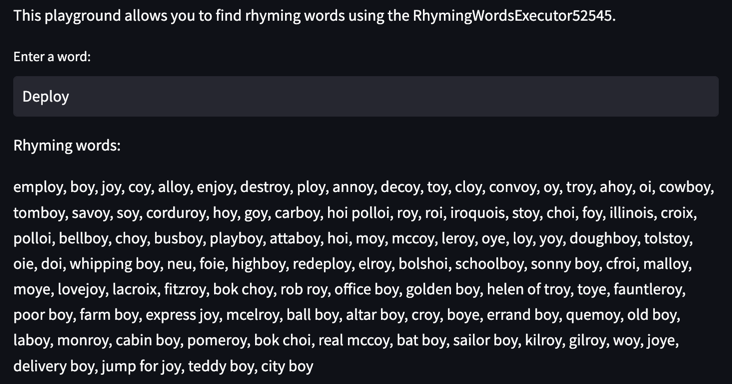

### Word Cloud Generator
```bash
gptdeploy generate \
--description "Generate a word cloud from a given text" \
--model gpt-4
```
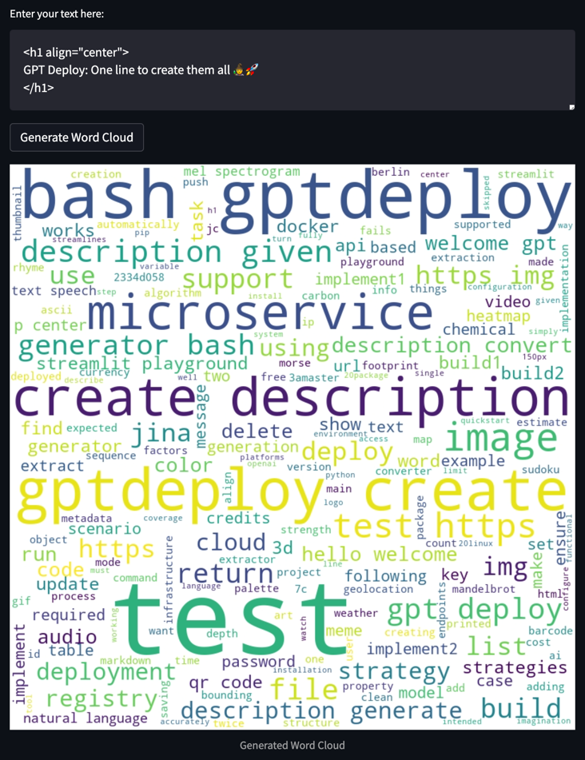

### 3d model info
```bash
gptdeploy generate \
--description "Given a 3d object, return vertex count and face count. Example: https://raw.githubusercontent.com/polygonjs/polygonjs-assets/master/models/wolf.obj" \
--model gpt-4
```
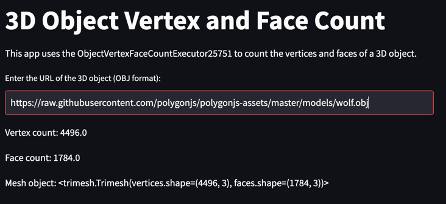

### Table extraction
```bash
gptdeploy generate \
--description "Given a URL, extract all tables as csv. Example: http://www.ins.tn/statistiques/90" \
--model gpt-4
```
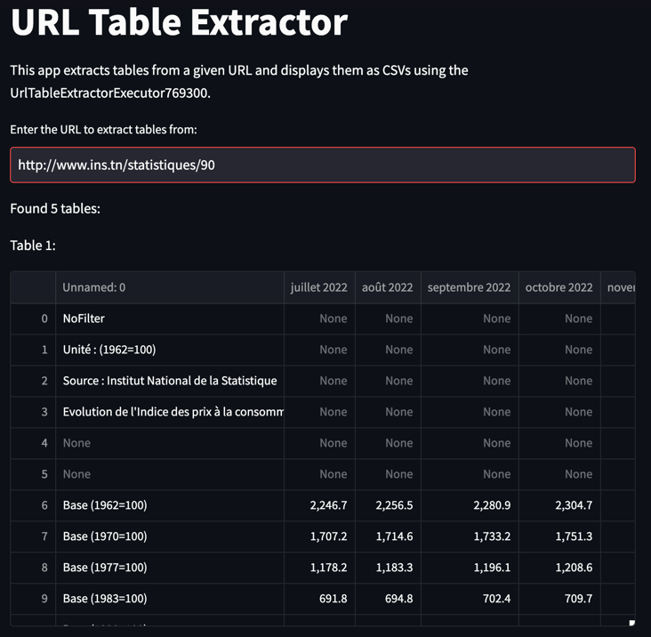

### Audio to mel spectrogram
```bash
gptdeploy generate \
--description "Create mel spectrogram from audio file. Example: https://cdn.pixabay.com/download/audio/2023/02/28/audio_550d815fa5.mp3" \
--model gpt-4
```
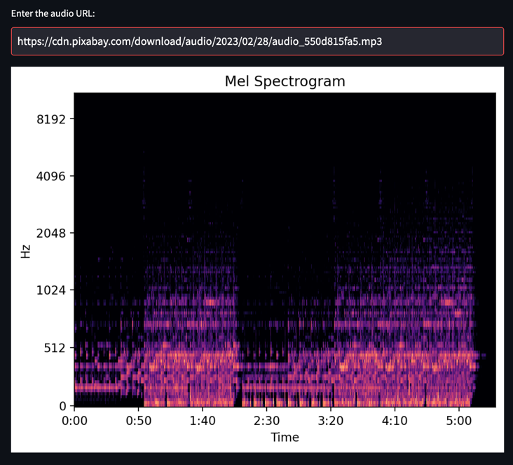

### Text to speech
```bash
gptdeploy generate \
--description "Convert text to speech" \
--model gpt-4
```
<a href=res/text_to_speech_example.wav>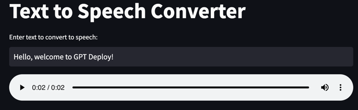</a>

<audio controls>
  <source src="res/text_to_speech_example.wav" type="audio/mpeg">
  Your browser does not support the audio element.
</audio>

### Heatmap Generator
```bash
gptdeploy generate \
--description "Create a heatmap from an image and a list of relative coordinates. Example input: https://images.unsplash.com/photo-1574786198875-49f5d09fe2d2, [[0.1, 0.2], [0.3, 0.4], [0.5, 0.6], [0.2, 0.1], [0.7, 0.2], [0.4, 0.2]]" \
--model gpt-4
```
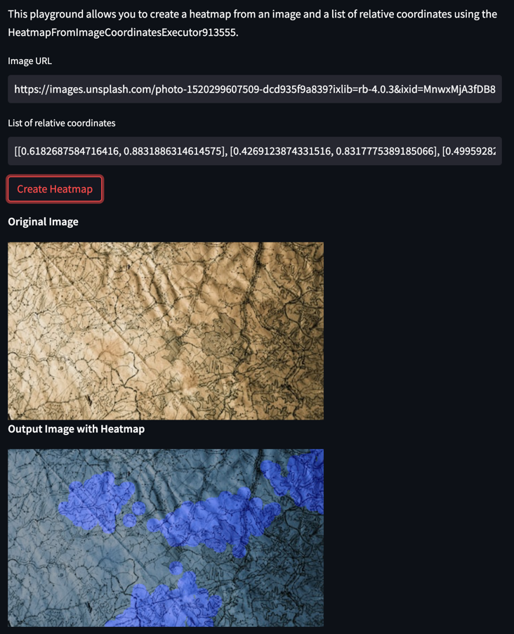

### QR Code Generator
```bash
gptdeploy generate \
--description "Generate QR code from URL. Example input: https://www.example.com" \
--model gpt-4 
```


### Mandelbrot Set Visualizer

```bash
gptdeploy generate \
--description "Visualize the Mandelbrot set with custom parameters. Example input: center=-0+1i, zoom=1.0, size=800x800, iterations=1000" \
--model gpt-4
```
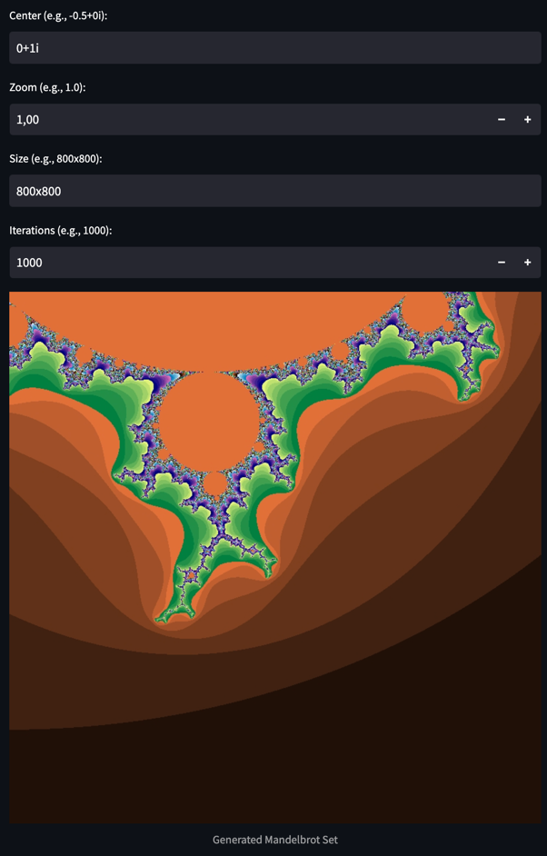


### Markdown to HTML Converter

```bash
gptdeploy generate --description "Convert markdown to HTML"
```

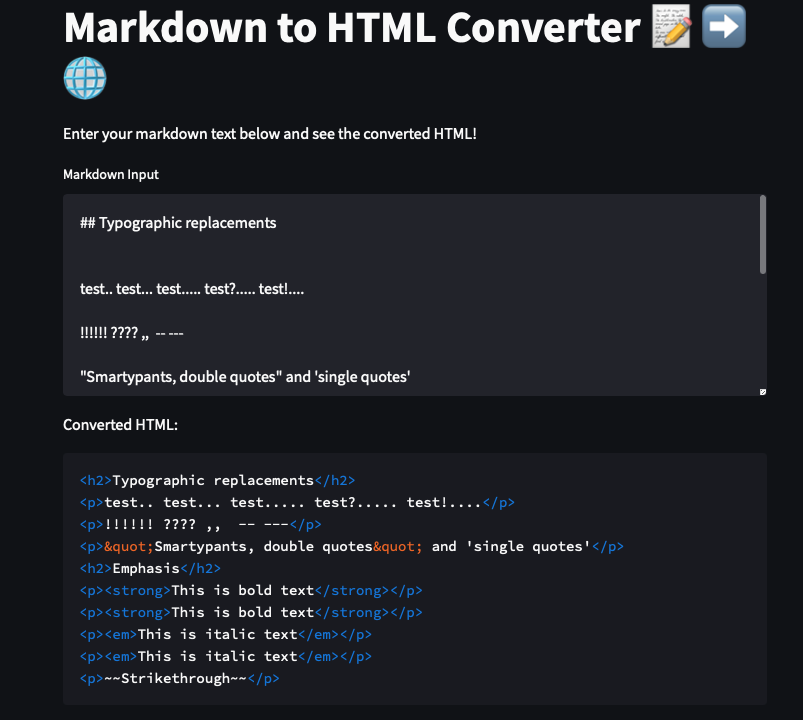


[//]: # (## TO BE TESTED)


[//]: # (### Password Strength Checker)

[//]: # (```bash)

[//]: # (gptdeploy generate --description "Given a password, return a score from 1 to 10 indicating the strength of the password" --test "Pa$$w0rd => 1/5, !Akfdh%.ytRadf => 5/5")

[//]: # (```)

[//]: # (### Morse Code Translator)

[//]: # (```bash)

[//]: # (gptdeploy generate --description "Convert text to morse code" --test "Hello, welcome to GPT Deploy!")

[//]: # (```)

[//]: # (### IP Geolocation)

[//]: # (```bash)

[//]: # (gptdeploy generate --description "Given an IP address, return the geolocation information" --test "142.251.46.174")

[//]: # (```)

[//]: # (### Currency Converter)

[//]: # (```bash)

[//]: # (gptdeploy generate --description "Converts any currency into any other" --test "1 usd to eur")

[//]: # (```)

[//]: # (### Image Resizer)

[//]: # (```bash)

[//]: # (gptdeploy generate --description "Given an image, resize it to a specified width and height" --test "https://images.unsplash.com/photo-1602738328654-51ab2ae6c4ff")

[//]: # (```)

[//]: # (### Weather API)

[//]: # (```bash)

[//]: # (gptdeploy generate --description "Given a city, return the current weather" --test "Berlin")

[//]: # (```)

[//]: # ()
[//]: # (### Sudoku Solver)

[//]: # (```bash)

[//]: # (gptdeploy generate --description "Given a sudoku puzzle, return the solution" --test "[[2, 5, 0, 0, 3, 0, 9, 0, 1], [0, 1, 0, 0, 0, 4, 0, 0, 0], [4, 0, 7, 0, 0, 0, 2, 0, 8], [0, 0, 5, 2, 0, 0, 0, 0, 0], [0, 0, 0, 0, 9, 8, 1, 0, 0], [0, 4, 0, 0, 0, 3, 0, 0, 0], [0, 0, 0, 3, 6, 0, 0, 7, 2], [0, 7, 0, 0, 0, 0, 0, 0, 3], [9, 0, 3, 0, 0, 0, 6, 0, 4]]")

[//]: # (```)

[//]: # ()
[//]: # (### Carbon Footprint Calculator)

[//]: # (```bash)

[//]: # (gptdeploy generate --description "Estimate a company's carbon footprint based on factors like transportation, electricity usage, waste production etc..." --test "Jina AI")

[//]: # (```)

[//]: # ()
[//]: # (### Real Estate Valuation Estimator)

[//]: # (```bash)

[//]: # (gptdeploy generate --description "Create a microservice that estimates the value of a property based on factors like location, property type, age, and square footage." --test "Berlin Friedrichshain, Flat, 100m², 10 years old")

[//]: # (```)

[//]: # ()
[//]: # (### Gene Sequence Alignment)

[//]: # (```bash)

[//]: # (gptdeploy generate --description "Align two DNA or RNA sequences using the Needleman-Wunsch algorithm" --test "AGTC, GTCA")

[//]: # (```)

[//]: # ()
[//]: # (### Barcode Generator)

[//]: # (```bash)

[//]: # (gptdeploy generate --description "Generate a barcode from a string" --test "Hello, welcome to GPT Deploy!")

[//]: # (```)

[//]: # ()
[//]: # (### File Compression)

[//]: # (```bash)

[//]: # (gptdeploy generate --description "Compress a file using the gzip algorithm" --test "content of the file: Hello, welcome to GPT Deploy!")

[//]: # (```)

[//]: # ()
[//]: # (### Watermarking Images)

[//]: # (```bash)

[//]: # (gptdeploy generate --description "Add a watermark &#40;GPT Deploy&#41; to an image" --test "https://images.unsplash.com/photo-1602738328654-51ab2ae6c4ff")

[//]: # (```)

[//]: # ()
[//]: # (### File Metadata Extractor)

[//]: # (```bash)

[//]: # (gptdeploy generate --description "Extract metadata from a file" --test "https://images.unsplash.com/photo-1602738328654-51ab2ae6c4ff")

[//]: # (```)

[//]: # ()
[//]: # (### Video Thumbnail Extractor)

[//]: # (```bash)

[//]: # (gptdeploy generate --description "Extract a thumbnail from a video" --test "http://techslides.com/demos/sample-videos/small.mp4")

[//]: # (```)

[//]: # ()
[//]: # (### Gif Maker)

[//]: # (```bash)

[//]: # (gptdeploy generate --description "Create a gif from a list of images" --test "https://images.unsplash.com/photo-1564725075388-cc8338732289, https://images.unsplash.com/photo-1584555684040-bad07f46a21f, https://images.unsplash.com/photo-1584555613497-9ecf9dd06f68")

[//]: # (```)

[//]: # ()

[//]: # ()

[//]: # (### Sound Visualizer)

[//]: # ()
[//]: # (```bash)

[//]: # (gptdeploy generate --description "Visualize a sound file and output the visualization as video combined with the sound" --test "some/mp3/file.mp3")

[//]: # (```)

[//]: # (## Upcoming Challenges)

[//]: # (### Color Palette Generator)

[//]: # (```bash)

[//]: # (gptdeploy generate --description "creates aesthetically pleasing color palettes based on a seed color, using color theory principles like complementary or analogous colors" --test "red")

[//]: # (```)

[//]: # ()
[//]: # (### Depth Map Generator)

[//]: # (```bash)

[//]: # (gptdeploy generate --description "Generate a depth map from a 3d Object" --test "https://raw.githubusercontent.com/polygonjs/polygonjs-assets/master/models/wolf.obj")

[//]: # (```)

[//]: # ()


[//]: # (### ASCII Art Generator)

[//]: # (```bash)

[//]: # (gptdeploy generate --description "Convert image to ASCII art" --test "https://images.unsplash.com/photo-1602738328654-51ab2ae6c4ff")

[//]: # (```)

[//]: # (generate --description "Get a png as input and return a vectorized version as svg." --test "Make sure when you convert the image back, it looks similar." --path microservice --verbose)

## Technical Insights
The graphic below illustrates the process of creating a microservice and deploying it to the cloud elaboration two different implementation strategies.

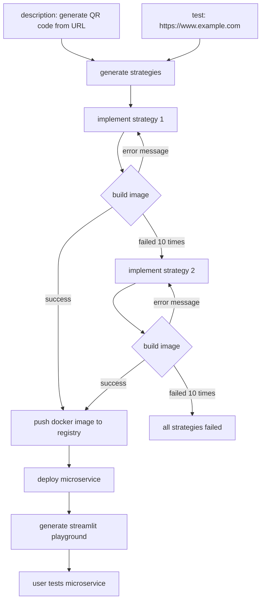

1. GPT Deploy identifies several strategies to implement your task.
2. It tests each strategy until it finds one that works.
3. For each strategy, it generates the following files:
- microservice.py: This is the main implementation of the microservice.
- test_microservice.py: These are test cases to ensure the microservice works as expected.
- requirements.txt: This file lists the packages needed by the microservice and its tests.
- Dockerfile: This file is used to run the microservice in a container and also runs the tests when building the image.
4. GPT Deploy attempts to build the image. If the build fails, it uses the error message to apply a fix and tries again to build the image.
5. Once it finds a successful strategy, it:
- Pushes the Docker image to the registry.
- Deploys the microservice.
- Generates a Streamlit playground where you can test the microservice.
6. If it fails 10 times in a row, it moves on to the next approach.


## 🔮 vision
Use natural language interface to generate, deploy and update your microservice infrastructure.

## ✨ Contributors 
If you want to contribute to this project, feel free to open a PR or an issue.
In the following, you can find a list of things that need to be done.

next steps:
- [ ] check if windows and linux support works
- [ ] add video to README.md
- [ ] bug: it can happen that the code generation is hanging forever - in this case aboard and redo the generation
- [ ] new user has free credits but should be told to verify account


Nice to have:
- [ ] smooth rendering animation of  the responses
- [ ] if the user runs gptdeploy without any arguments, show the help message
- [ ] don't show this message: 
🔐 You are logged in to Jina AI as florian.hoenicke (username:auth0-unified-448f11965ce142b6). 
To log out, use jina auth logout.
- [ ] put the playground into the custom gateway (without rebuilding the custom gateway)
- [ ] hide prompts in normal mode and show them in verbose mode
- [ ] tests
- [ ] clean up duplicate code
- [ ] support popular cloud providers - lambda, cloud run, cloud functions, ...
- [ ] support local docker builds
- [ ] autoscaling enabled for cost saving
- [ ] add more examples to README.md
- [ ] support multiple endpoints - example: todolist microservice with endpoints for adding, deleting, and listing todos
- [ ] support stateful microservices
- [ ] The playground is currently printed twice even if it did not change. 
Make sure it is only printed twice in case it changed.
- [ ] allow to update your microservice by providing feedback
- [ ] support for other large language models like Open Assistent
- [ ] for cost savings, it should be possible to insert less context during the code generation of the main functionality - no jina knowledge is required
- [ ] use gptdeploy list to show all deployments
- [ ] gptdeploy delete to delete a deployment
- [ ] gptdeploy update to update a deployment
- [ ] test param optional - in case the test param is not there first ask gpt if more information is required to write a test - like access to pdf data
- [ ] section for microservices built by the community
- [ ] test feedback for playground generation (could be part of the debugging)
- [ ] should we send everything via json in the text attribute for simplicity?
- [ ] fix release workflow
- [ ] after the user specified the task, ask them questions back if the task is not clear enough or something is missing

Proposal:
- [ ] just generate the non-jina related code and insert it into an executor template
- [ ] think about strategies after the first approach failed?
